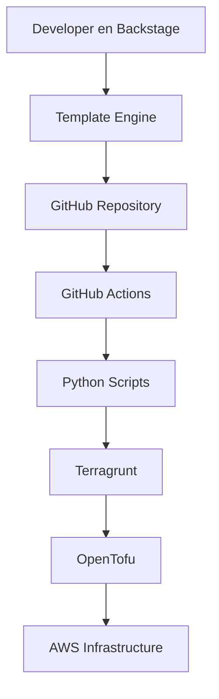

# 🤖 Stack de Automatización IaC - BillPay

## 🎯 Flujo Completo Developer Self-Service



## 🏗️ Arquitectura del Stack

### **1. Backstage (Developer Portal)**
```
backstage/
├── app-config.yaml           # Configuración principal
├── catalog/                  # Catálogo de servicios
├── scaffolder-templates/     # Templates del scaffolder
│   ├── billpay-service/      # Template para microservicios
│   ├── billpay-frontend/     # Template para frontends
│   └── billpay-infrastructure/ # Template para infraestructura
└── techdocs/                # Documentación técnica
```

### **2. Template Engine (Cookiecutter + Jinja2)**
```
templates/
├── cookiecutter/
│   ├── microservice/         # Template Java microservice
│   ├── frontend/             # Template Angular frontend
│   └── infrastructure/       # Template infraestructura
├── jinja2/
│   ├── terraform/            # Templates OpenTofu
│   ├── kubernetes/           # Templates K8s
│   └── github-actions/       # Templates CI/CD
└── backstage-integration/
    ├── catalog-info.yaml.j2  # Template catálogo Backstage
    └── mkdocs.yml.j2         # Template documentación
```

### **3. Infrastructure as Code Stack**
```
infrastructure/
├── terragrunt/               # 🔄 DRY Configuration
│   ├── terragrunt.hcl       # Configuración global
│   ├── environments/
│   │   ├── dev/
│   │   ├── staging/
│   │   └── prod/
│   └── modules/             # Módulos reutilizables
├── opentofu/                # 🛠️ Infrastructure Modules
│   ├── aws/
│   │   ├── eks/             # EKS cluster
│   │   ├── ecr/             # Container registry
│   │   ├── s3-cloudfront/   # Frontend hosting
│   │   └── networking/      # VPC, subnets, etc.
│   ├── gcp/                 # Google Cloud modules
│   ├── azure/               # Azure modules
│   └── oci/                 # Oracle Cloud modules
└── python-scripts/          # 🐍 Dynamic Automation
    ├── infrastructure-manager.py
    ├── deployment-orchestrator.py
    └── environment-provisioner.py
```

## 🚀 Flujo de Trabajo Detallado

### **Paso 1: Developer Self-Service (Backstage)**
```yaml
# El developer accede a Backstage y:
1. Selecciona template "BillPay Infrastructure"
2. Configura parámetros:
   - Cloud provider: AWS/GCP/Azure/OCI
   - Environment: dev/staging/prod
   - Services: backend, frontend-a, frontend-b, feature-flags
3. Backstage genera código usando Cookiecutter + Jinja2
4. Crea pull request automático en GitHub
```

### **Paso 2: GitHub Actions (CI/CD)**
```yaml
# .github/workflows/infrastructure.yml
name: Deploy Infrastructure
on:
  push:
    paths: ['infrastructure/**']
jobs:
  deploy:
    runs-on: ubuntu-latest
    steps:
      - uses: actions/checkout@v4
      - name: Setup Python
        uses: actions/setup-python@v4
      - name: Run Infrastructure Manager
        run: python infrastructure/python-scripts/infrastructure-manager.py
      - name: Deploy with Terragrunt
        run: terragrunt apply-all
```

### **Paso 3: Python Scripts (Orchestration)**
```python
# infrastructure/python-scripts/infrastructure-manager.py
class InfrastructureManager:
    def __init__(self, cloud_provider, environment):
        self.cloud = cloud_provider
        self.env = environment
    
    def deploy_complete_stack(self):
        # 1. Generar configuración Terragrunt dinámica
        self.generate_terragrunt_config()
        # 2. Ejecutar OpenTofu modules
        self.deploy_infrastructure()
        # 3. Configurar aplicaciones
        self.setup_applications()
```

### **Paso 4: Terragrunt (DRY Configuration)**
```hcl
# infrastructure/terragrunt/environments/dev/terragrunt.hcl
terraform {
  source = "../../opentofu/aws/complete-stack"
}

inputs = {
  environment = "dev"
  cluster_size = 2
  instance_type = "t3.medium"
  enable_monitoring = false
}
```

### **Paso 5: OpenTofu (Infrastructure)**
```hcl
# infrastructure/opentofu/aws/complete-stack/main.tf
module "networking" {
  source = "../networking"
  environment = var.environment
}

module "eks" {
  source = "../eks"
  vpc_id = module.networking.vpc_id
  subnet_ids = module.networking.private_subnet_ids
}
```

## 🎭 Integración con Backstage

### **Templates Backstage**
```yaml
# backstage/scaffolder-templates/billpay-infrastructure/template.yaml
apiVersion: scaffolder.backstage.io/v1beta3
kind: Template
metadata:
  name: billpay-infrastructure
  title: BillPay Infrastructure Multi-Cloud
spec:
  parameters:
    - title: Cloud Configuration
      properties:
        cloudProvider:
          type: string
          enum: ['aws', 'gcp', 'azure', 'oci']
        environment:
          type: string
          enum: ['dev', 'staging', 'prod']
  steps:
    - id: generate
      name: Generate Infrastructure Code
      action: fetch:cookiecutter
      input:
        url: ./templates/cookiecutter/infrastructure
        values:
          cloud_provider: ${{ parameters.cloudProvider }}
          environment: ${{ parameters.environment }}
```

## 🔧 Herramientas MCP Integradas

### **mcp-billpay-deploy**
```python
# Funciones disponibles:
- setup_complete_infrastructure()    # Stack completo
- deploy_eks_cluster()              # Solo EKS
- setup_frontend_infrastructure()   # S3 + CloudFront
- setup_backstage_integration()     # Integración Backstage
- generate_software_templates()     # Templates dinámicos
```

## 📋 Plan de Implementación Actualizado

### **Fase 2A: IaC Automation Stack** (3 días)
1. **Día 1**: Template Engine (Cookiecutter + Jinja2)
2. **Día 2**: Terragrunt DRY configuration + OpenTofu modules
3. **Día 3**: Python scripts + GitHub Actions integration

### **Fase 2B: Infraestructura Base** (3 días)
1. **Día 1**: VPC + Networking via automation
2. **Día 2**: EKS Cluster via automation
3. **Día 3**: ECR + S3 + CloudFront via automation

### **Fase 3: Backstage Integration** (2 días)
1. **Día 1**: Templates Backstage + TechDocs
2. **Día 2**: Developer Self-Service completo

## 🚀 Comandos de Ejecución

### **Desarrollo Local**
```bash
# 1. Iniciar Backstage
cd backstage && npm start

# 2. Generar infraestructura desde template
cookiecutter templates/cookiecutter/infrastructure

# 3. Deploy manual
cd infrastructure && terragrunt apply-all
```

### **Producción (GitHub Actions)**
```bash
# Push a main → Deploy automático
git push origin main
```

## ✅ Criterios de Éxito

- ✅ Developer puede crear infraestructura desde Backstage
- ✅ Templates generan código OpenTofu + Terragrunt
- ✅ Python scripts orquestan el deployment
- ✅ GitHub Actions automatiza todo el flujo
- ✅ Multi-cloud support (AWS/GCP/Azure/OCI)
- ✅ Documentación automática en TechDocs

---
**Próximo paso**: Implementar Fase 2A - IaC Automation Stack
