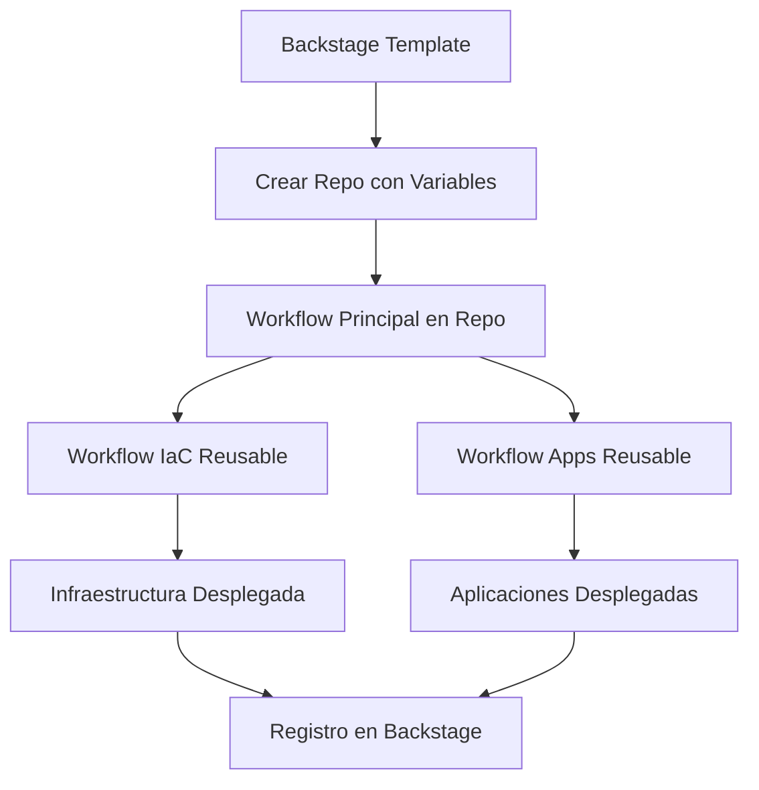

# 🎯 **PLAN DE ACCIÓN - CORRECCIÓN INTEGRACIÓN BACKSTAGE ↔ GITHUB ACTIONS**

## **📋 PROBLEMAS IDENTIFICADOS**

### **❌ Fallas Críticas**
1. **Variables no se pasan** de Backstage a GitHub Actions
2. **Workflows no son reusables** en ia-ops-iac
3. **Flujo roto**: Template → Repo → Workflow diferente
4. **Separación incorrecta** IaC vs Apps

### **🔍 Análisis Detallado**
- Templates de Backstage NO pasan variables correctamente a GitHub Actions
- Workflows esperan `inputs` pero templates usan `github:actions:dispatch` incorrectamente
- No hay sincronización entre parámetros de Backstage y inputs de workflow
- Template genera workflow que intenta usar `uses:` con otro workflow (no válido)
- Workflows en `ia-ops-iac` no están configurados como reusables
- Variables de Backstage se pierden en el proceso

## **🚀 PLAN DE CORRECCIÓN**

### **FASE 1: Workflows Reusables (ia-ops-iac)**
```bash
# Archivos a modificar/crear:
├── .github/workflows/
│   ├── deploy-infrastructure-reusable.yml    # NUEVO - IaC reusable
│   ├── deploy-applications-reusable.yml      # NUEVO - Apps reusable  
│   ├── deploy-simple-oidc.yml               # MODIFICAR - hacer reusable
│   └── deploy-complete.yml                  # MODIFICAR - hacer reusable
```

### **FASE 2: Templates Backstage**
```bash
# Archivos a corregir:
├── templates_backstage/
│   ├── billpay-demo-simple/
│   │   ├── template.yaml                    # CORREGIR - paso variables
│   │   └── skeleton/.github/workflows/
│   │       └── deploy.yml                   # REESCRIBIR - workflow principal
│   └── billpay-complete-stack/
│       ├── template.yaml                    # CORREGIR - paso variables
│       └── skeleton/.github/workflows/
│           └── deploy.yml                   # CREAR - workflow principal
```

### **FASE 3: Flujo de Variables**
```yaml
# Flujo correcto:
Backstage Parameters → Template → Repo Workflow → Reusable Workflows
```

## **📝 PASOS DETALLADOS**

### **PASO 1: Crear Workflows Reusables**

#### **Archivo**: `ia-ops-iac/.github/workflows/deploy-infrastructure-reusable.yml`
```yaml
name: 🏗️ Deploy Infrastructure (Reusable)
on:
  workflow_call:
    inputs:
      project_name:
        required: true
        type: string
      environment:
        required: true
        type: string
      cloud_provider:
        required: true
        type: string
      region:
        required: true
        type: string
      auth_method:
        required: true
        type: string
    outputs:
      infrastructure_status:
        description: "Infrastructure deployment status"
        value: ${{ jobs.deploy-infrastructure.outputs.status }}
      cluster_endpoint:
        description: "Kubernetes cluster endpoint"
        value: ${{ jobs.deploy-infrastructure.outputs.cluster_endpoint }}

jobs:
  deploy-infrastructure:
    name: 🏗️ Deploy Infrastructure
    runs-on: ubuntu-latest
    outputs:
      status: ${{ steps.deploy.outputs.status }}
      cluster_endpoint: ${{ steps.deploy.outputs.cluster_endpoint }}
    
    steps:
      - name: 🔐 Configure Cloud Credentials
        # Configuración específica por cloud provider
        
      - name: 🏗️ Deploy Infrastructure
        id: deploy
        # Lógica de despliegue de infraestructura
```

#### **Archivo**: `ia-ops-iac/.github/workflows/deploy-applications-reusable.yml`
```yaml
name: 🚀 Deploy Applications (Reusable)
on:
  workflow_call:
    inputs:
      project_name:
        required: true
        type: string
      environment:
        required: true
        type: string
      cluster_endpoint:
        required: true
        type: string
      backend_repo:
        required: false
        type: string
        default: "poc-billpay-back"
      frontend_repos:
        required: false
        type: string
        default: "poc-billpay-front-a,poc-billpay-front-b,poc-billpay-front-feature-flags"

jobs:
  deploy-backend:
    name: 🔧 Deploy Backend
    runs-on: ubuntu-latest
    steps:
      - name: 🚀 Deploy Backend Service
        # Lógica de despliegue del backend
        
  deploy-frontends:
    name: 🌐 Deploy Frontends
    runs-on: ubuntu-latest
    strategy:
      matrix:
        frontend: ${{ fromJson(inputs.frontend_repos) }}
    steps:
      - name: 🚀 Deploy Frontend ${{ matrix.frontend }}
        # Lógica de despliegue de frontends
```

### **PASO 2: Corregir Template Simple**

#### **Archivo**: `templates_backstage/billpay-demo-simple/template.yaml`
```yaml
steps:
  - id: fetch-base
    name: Fetch Base Template
    action: fetch:template
    input:
      url: ./skeleton
      values:
        project_name: ${{ parameters.project_name }}
        environment: ${{ parameters.environment }}
        deployment_type: ${{ parameters.deployment_type }}
        description: ${{ parameters.description }}
        # AGREGAR todas las variables necesarias para workflows

  - id: publish
    name: Publish to GitHub
    action: publish:github
    input:
      allowedHosts: ['github.com']
      description: ${{ parameters.description }}
      repoUrl: github.com?owner=giovanemere&repo=${{ parameters.project_name }}
      defaultBranch: main

  - id: register
    name: Register in Catalog
    action: catalog:register
    input:
      repoContentsUrl: ${{ steps.publish.output.repoContentsUrl }}
      catalogInfoPath: '/catalog-info.yaml'

  - id: trigger-workflow
    name: Trigger Deployment
    action: github:actions:dispatch
    input:
      repoUrl: github.com?owner=giovanemere&repo=${{ parameters.project_name }}
      workflowId: deploy.yml
      branchOrTagName: main
      workflowInputs:
        deployment_type: ${{ parameters.deployment_type }}
        project_name: ${{ parameters.project_name }}
        environment: ${{ parameters.environment }}
        # PASAR TODAS LAS VARIABLES NECESARIAS
```

### **PASO 3: Crear Workflow Principal en Skeleton**

#### **Archivo**: `billpay-demo-simple/skeleton/.github/workflows/deploy.yml`
```yaml
name: 🚀 BillPay Demo Deploy
on:
  push:
    branches: [main]
  workflow_dispatch:
    inputs:
      deployment_type:
        required: true
        type: string
        default: '${{ values.deployment_type }}'
      project_name:
        required: false
        type: string
        default: '${{ values.project_name }}'
      environment:
        required: false
        type: string
        default: '${{ values.environment }}'

env:
  PROJECT_NAME: ${{ inputs.project_name || '${{ values.project_name }}' }}
  ENVIRONMENT: ${{ inputs.environment || '${{ values.environment }}' }}
  DEPLOYMENT_TYPE: ${{ inputs.deployment_type || '${{ values.deployment_type }}' }}

jobs:
  deploy-infrastructure:
    name: 🏗️ Deploy Infrastructure
    uses: giovanemere/ia-ops-iac/.github/workflows/deploy-infrastructure-reusable.yml@main
    with:
      project_name: ${{ env.PROJECT_NAME }}
      environment: ${{ env.ENVIRONMENT }}
      cloud_provider: "aws"
      region: "us-east-1"
      auth_method: ${{ env.DEPLOYMENT_TYPE == 'real-aws-oidc' && 'oidc' || 'legacy' }}
    secrets: inherit
    
  deploy-applications:
    name: 🚀 Deploy Applications
    needs: deploy-infrastructure
    if: ${{ env.DEPLOYMENT_TYPE != 'simulation' }}
    uses: giovanemere/ia-ops-iac/.github/workflows/deploy-applications-reusable.yml@main
    with:
      project_name: ${{ env.PROJECT_NAME }}
      environment: ${{ env.ENVIRONMENT }}
      cluster_endpoint: ${{ needs.deploy-infrastructure.outputs.cluster_endpoint }}
    secrets: inherit

  simulation-mode:
    name: 🎭 Simulation Mode
    if: ${{ env.DEPLOYMENT_TYPE == 'simulation' }}
    runs-on: ubuntu-latest
    steps:
      - name: 🎭 Run Simulation
        run: |
          echo "🎭 Running BillPay deployment simulation..."
          echo "✅ Infrastructure simulated successfully"
          echo "✅ Applications simulated successfully"
```

## **🔧 ORDEN DE IMPLEMENTACIÓN**

### **1️⃣ PASO 1: Workflows Reusables (30 min)**
```bash
cd /home/giovanemere/periferia/billpay/repositories/ia-ops-iac
# Crear deploy-infrastructure-reusable.yml
# Crear deploy-applications-reusable.yml
# Modificar workflows existentes para ser reusables
```

### **2️⃣ PASO 2: Template Simple (20 min)**
```bash
cd /home/giovanemere/ia-ops/ia-ops-backstage/templates_backstage/billpay-demo-simple
# Corregir template.yaml
# Reescribir skeleton/deploy.yml
# Probar paso de variables
```

### **3️⃣ PASO 3: Template Complete (20 min)**
```bash
cd /home/giovanemere/ia-ops/ia-ops-backstage/templates_backstage/billpay-complete-stack
# Aplicar mismas correcciones
# Agregar parámetros multi-cloud
# Crear workflow completo
```

### **4️⃣ PASO 4: Testing (15 min)**
```bash
cd /home/giovanemere/ia-ops/ia-ops-backstage
./scripts/start-development.sh
# Probar template simple
# Verificar paso de variables
# Validar workflows reusables
```

## **✅ CRITERIOS DE ÉXITO**

1. **Variables pasan correctamente** Backstage → GitHub Actions
2. **Workflows son reusables** y modulares
3. **Separación clara** IaC vs Apps
4. **Flujo completo funciona** end-to-end
5. **Logs claros** en cada paso

## **🎯 ARQUITECTURA OBJETIVO**



## **📂 ARCHIVOS AFECTADOS**

### **Repositorio: ia-ops-iac**
- `.github/workflows/deploy-infrastructure-reusable.yml` (NUEVO)
- `.github/workflows/deploy-applications-reusable.yml` (NUEVO)
- `.github/workflows/deploy-simple-oidc.yml` (MODIFICAR)
- `.github/workflows/deploy-complete.yml` (MODIFICAR)

### **Repositorio: ia-ops-backstage**
- `templates_backstage/billpay-demo-simple/template.yaml` (MODIFICAR)
- `templates_backstage/billpay-demo-simple/skeleton/.github/workflows/deploy.yml` (REESCRIBIR)
- `templates_backstage/billpay-complete-stack/template.yaml` (MODIFICAR)
- `templates_backstage/billpay-complete-stack/skeleton/.github/workflows/deploy.yml` (CREAR)

## **🚀 COMANDOS DE IMPLEMENTACIÓN**

```bash
# 1. Workflows Reusables
cd /home/giovanemere/periferia/billpay/repositories/ia-ops-iac
# Crear workflows reusables

# 2. Templates Backstage
cd /home/giovanemere/ia-ops/ia-ops-backstage/templates_backstage
# Corregir templates

# 3. Testing
cd /home/giovanemere/ia-ops/ia-ops-backstage
./scripts/start-development.sh
```

---

**Fecha**: 2025-09-25  
**Estado**: Plan definido - Listo para implementación  
**Prioridad**: Alta - Bloquea flujo completo Developer Self-Service
