# Deployment Context - BillPay Complete Stack

## 🚀 DEPLOYMENT FLOW

### **1. Infrastructure Deployment Order:**

```mermaid
graph TB
    VPC[🌐 VPC Network] --> EKS[☸️ Kubernetes Cluster]
    VPC --> ECR[🐳 Container Registry]
    VPC --> S3[💾 S3 Buckets]
    EKS --> ALB[⚖️ Load Balancer]
    S3 --> CF[☁️ CloudFront CDN]
    EKS --> SM[🔒 Secrets Manager]
    ALB --> MON[📊 Monitoring]
```


### **2. Application Deployment Order:**

```mermaid
graph TB
    ECR[🐳 Images Built] --> BACKEND[🔧 Backend API]
    BACKEND --> PAYMENT[💳 Payment Service]
    BACKEND --> USER[👤 User Service]
    PAYMENT --> ADMIN[⚙️ Admin Service]
    S3[💾 S3 Ready] --> FE_PAY[🎨 Frontend Payment]
    S3 --> FE_ADMIN[🎨 Frontend Admin]
    S3 --> FF[🎛️ Feature Flags]
```


## 🎯 DEPLOYMENT PHASES

### **Phase 1: Infrastructure (15-20 min)**
```yaml
infrastructure_components:
  vpc:
    resource: aws_vpc
    cidr: 10.0.0.0/16
    subnets: 
      - public: 10.0.1.0/24, 10.0.2.0/24
      - private: 10.0.10.0/24, 10.0.20.0/24
  
  eks:
    resource: aws_eks_cluster
    version: "1.28"
    node_groups:
      - name: billpay-nodes
        instance_type: t3.medium
        min_size: 2
        max_size: 10
  
  ecr:
    repositories:
      - billpay-backend-api
      - billpay-payment-service
      - billpay-user-service
      - billpay-admin-service
  
  s3_cloudfront:
    buckets:
      - billpay-frontend-payment
      - billpay-frontend-admin
      - billpay-feature-flags
    distributions: 3
```

### **Phase 2: Applications (10-15 min)**
```yaml
billpay_applications:
  backend_services:
    - name: backend-api
      image: ecr_repo/billpay-backend-api:latest
      replicas: 2
      resources:
        cpu: 500m
        memory: 1Gi
    
    - name: payment-service
      image: ecr_repo/billpay-payment-service:latest
      replicas: 3
      resources:
        cpu: 1000m
        memory: 2Gi
  
  frontend_apps:
    - name: frontend-payment
      bucket: billpay-frontend-payment
      cloudfront: true
      custom_domain: payments.billpay.com
    
    - name: frontend-admin
      bucket: billpay-frontend-admin
      cloudfront: true
      custom_domain: admin.billpay.com
```

## 🔐 SECURITY CONTEXT

### **OIDC Configuration:**
```yaml
oidc_provider: token.actions.githubusercontent.com
iam_role: BillPayGitHubActionsRole
permissions:
  - s3:*
  - eks:*
  - ecr:*
  - cloudfront:*
  - iam:PassRole
  - logs:*
session_duration: 3600  # 1 hour
```

### **Secrets Management:**
```yaml
secrets_manager:
  secrets:
    - name: billpay/database/credentials
      description: Database connection credentials
    - name: billpay/api/keys
      description: External API keys
    - name: billpay/jwt/secret
      description: JWT signing secret
  rotation: enabled
  encryption: aws-kms
```

## 📊 MONITORING CONTEXT

### **CloudWatch Configuration:**
```yaml
monitoring:
  log_groups:
    - /aws/eks/billpay-cluster/cluster
    - /aws/lambda/billpay-functions
    - /aws/apigateway/billpay-api
  
  metrics:
    - namespace: BillPay/Backend
      metrics: [RequestCount, ResponseTime, ErrorRate]
    - namespace: BillPay/Frontend
      metrics: [PageViews, LoadTime, ErrorRate]
  
  alarms:
    - name: HighErrorRate
      threshold: 5%
      action: sns_notification
    - name: HighResponseTime
      threshold: 2000ms
      action: auto_scaling
```

## 💰 COST ESTIMATION

### **By Environment:**
```yaml
cost_estimation:
  dev:
    monthly: $170-265
    components:
      eks: $73 (cluster) + $60 (nodes)
      s3_cloudfront: $20-30
      ecr: $10
      other: $7-92
  
  staging:
    monthly: $200-300
    components:
      eks: $73 + $80 (more nodes)
      s3_cloudfront: $25-35
      ecr: $15
      monitoring: $20-30
      other: $7-137
  
  prod:
    monthly: $300-450
    components:
      eks: $73 + $150 (production nodes)
      s3_cloudfront: $40-60
      ecr: $25
      monitoring: $50-80
      backup: $20-30
      other: $7-177
```
