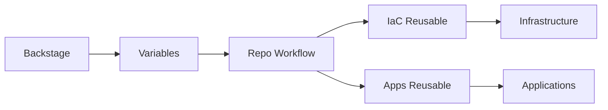

# 🤖 **MCP DEPLOYMENT TASKS - BACKSTAGE INTEGRATION FIX**

## **📋 TAREAS PARA MCP BILLPAY DEPLOY**

### **🎯 OBJETIVO**
Corregir integración Backstage ↔ GitHub Actions para flujo completo:
1. **IaC Deployment** (Infraestructura)
2. **Apps Deployment** (Aplicaciones)

### **❌ PROBLEMAS ACTUALES**
- Variables Backstage NO pasan a GitHub Actions
- Workflows NO son reusables
- Flujo roto: Template → Repo → Workflow diferente

### **🔧 TAREAS MCP**

#### **TAREA 1: `fix_workflows_reusable`**
```python
def fix_workflows_reusable():
    """Crear workflows reusables en ia-ops-iac"""
    # Crear: deploy-infrastructure-reusable.yml
    # Crear: deploy-applications-reusable.yml
    # Modificar: workflows existentes para ser reusables
```

#### **TAREA 2: `fix_backstage_templates`**
```python
def fix_backstage_templates():
    """Corregir templates Backstage para paso correcto de variables"""
    # Corregir: billpay-demo-simple/template.yaml
    # Corregir: billpay-complete-stack/template.yaml
    # Reescribir: skeleton workflows
```

#### **TAREA 3: `create_integration_workflows`**
```python
def create_integration_workflows():
    """Crear workflows principales en skeletons"""
    # Crear: skeleton/.github/workflows/deploy.yml (simple)
    # Crear: skeleton/.github/workflows/deploy.yml (complete)
    # Configurar: paso correcto de variables
```

#### **TAREA 4: `test_integration_flow`**
```python
def test_integration_flow():
    """Probar flujo completo Backstage → GitHub Actions"""
    # Probar: template simple
    # Verificar: paso de variables
    # Validar: workflows reusables
```

### **📂 ARCHIVOS A MODIFICAR**

#### **Repositorio: ia-ops-iac**
```bash
├── .github/workflows/
│   ├── deploy-infrastructure-reusable.yml    # CREAR
│   ├── deploy-applications-reusable.yml      # CREAR
│   ├── deploy-simple-oidc.yml               # MODIFICAR
│   └── deploy-complete.yml                  # MODIFICAR
```

#### **Repositorio: ia-ops-backstage**
```bash
├── templates_backstage/
│   ├── billpay-demo-simple/
│   │   ├── template.yaml                    # MODIFICAR
│   │   └── skeleton/.github/workflows/
│   │       └── deploy.yml                   # REESCRIBIR
│   └── billpay-complete-stack/
│       ├── template.yaml                    # MODIFICAR
│       └── skeleton/.github/workflows/
│           └── deploy.yml                   # CREAR
```

### **🎯 FLUJO OBJETIVO**



### **✅ CRITERIOS DE ÉXITO**
1. Variables pasan Backstage → GitHub Actions
2. Workflows modulares y reusables
3. Separación IaC vs Apps
4. Flujo end-to-end funcional

### **🚀 COMANDOS MCP**

```python
# Implementación completa
mcp_billpay_deploy.fix_workflows_reusable()
mcp_billpay_deploy.fix_backstage_templates()
mcp_billpay_deploy.create_integration_workflows()
mcp_billpay_deploy.test_integration_flow()
```

### **📍 UBICACIONES**

- **Plan Completo**: `/home/giovanemere/periferia/billpay/docs/BACKSTAGE_GITHUB_INTEGRATION_FIX.md`
- **Repositorio IaC**: `/home/giovanemere/periferia/billpay/repositories/ia-ops-iac/`
- **Backstage Templates**: `/home/giovanemere/ia-ops/ia-ops-backstage/templates_backstage/`

---

**Estado**: Documentado - Listo para implementación MCP  
**Prioridad**: Alta - Desbloquea Developer Self-Service completo
