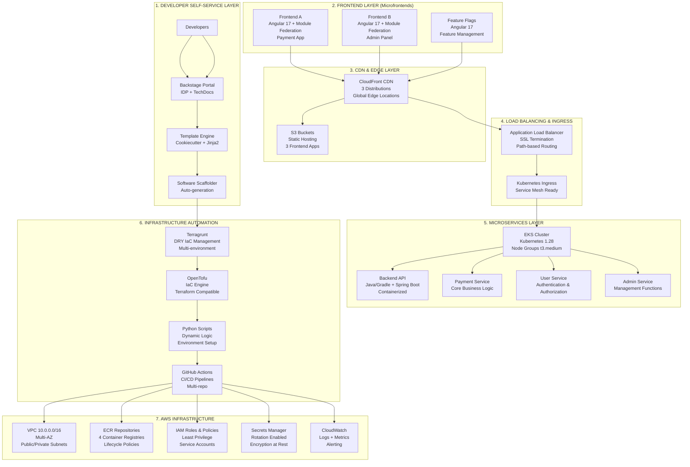

# BillPay - Arquitectura Enterprise

## 🏗️ ARQUITECTURA COMPLETA DE 6 CAPAS

## 🎯 COMPONENTES DETALLADOS

### **Frontend Applications (Microfrontends)**
- **Frontend A**: Aplicación principal de pagos (customer-facing)
- **Frontend B**: Panel administrativo (internal operations)
- **Feature Flags**: Gestión de funcionalidades (feature toggles)

**Tecnologías**:
- Angular 17 + TypeScript
- Module Federation (Webpack 5)
- Micro-frontend architecture
- Shared component library

### **Backend Services (Microservicios)**
- **Backend API**: Gateway y orquestación
- **Payment Service**: Procesamiento de pagos core
- **User Service**: Gestión de usuarios y autenticación
- **Admin Service**: Funciones administrativas

**Tecnologías**:
- Java/Gradle + Spring Boot
- Docker containerization
- Kubernetes deployment
- RESTful APIs + OpenAPI

### **Infrastructure Services**
- **Backstage**: Developer portal e IDP
- **Template Engine**: Cookiecutter + Jinja2
- **Monitoring**: CloudWatch + Prometheus + Grafana
- **Security**: AWS IAM + Secrets Manager

## 🔧 STACK TECNOLÓGICO COMPLETO

### **Frontend Stack**
- **Framework**: Angular 17
- **Architecture**: Module Federation
- **Build Tool**: Webpack 5 + Angular CLI
- **Hosting**: S3 + CloudFront
- **Deployment**: GitHub Actions → S3 sync

### **Backend Stack**
- **Runtime**: Java 17 + Gradle
- **Framework**: Spring Boot 3.x
- **Containerization**: Docker + multi-stage builds
- **Orchestration**: Kubernetes (EKS)
- **Registry**: Amazon ECR
- **Deployment**: GitHub Actions → ECR → EKS

### **Infrastructure Stack**
- **IaC Engine**: OpenTofu (Terraform compatible)
- **IaC Management**: Terragrunt (DRY principle)
- **Template Engine**: Cookiecutter + Jinja2
- **CI/CD**: GitHub Actions
- **Secrets**: AWS Secrets Manager
- **Monitoring**: CloudWatch + Prometheus

### **Developer Experience Stack**
- **Portal**: Backstage (Spotify's IDP)
- **Documentation**: TechDocs (MkDocs)
- **Templates**: Software scaffolding
- **Catalog**: Service discovery
- **Workflows**: Automated provisioning

## ☁️ AWS SERVICES ARCHITECTURE

### **Compute & Containers**
- **EKS Cluster**: Managed Kubernetes (v1.28)
- **Node Groups**: t3.medium instances (auto-scaling)
- **ECR**: 4 private repositories with lifecycle policies
- **Fargate**: Serverless containers (optional)

### **Networking & Security**
- **VPC**: 10.0.0.0/16 with multi-AZ subnets
- **ALB**: Application Load Balancer with SSL termination
- **Security Groups**: Least privilege network access
- **NAT Gateway**: Outbound internet for private subnets
- **Internet Gateway**: Public subnet internet access

### **Storage & CDN**
- **S3 Buckets**: 4 buckets (3 frontends + 1 TechDocs)
- **CloudFront**: 3 CDN distributions with custom domains
- **EBS**: Persistent volumes for stateful workloads
- **EFS**: Shared file system (if needed)

### **Security & Compliance**
- **IAM**: Roles, policies, and service accounts
- **Secrets Manager**: Encrypted secrets with rotation
- **Certificate Manager**: SSL/TLS certificates
- **CloudTrail**: API audit logging
- **GuardDuty**: Threat detection (optional)

### **Monitoring & Observability**
- **CloudWatch**: Logs, metrics, and alarms
- **X-Ray**: Distributed tracing (optional)
- **Prometheus**: Kubernetes metrics
- **Grafana**: Dashboards and visualization

## 🔄 FLUJOS ARQUITECTURALES

### **Developer Workflow**
1. **Developer** → Backstage Portal
2. **Select Template** → Software Scaffolder
3. **Generate Code** → Git Repository
4. **Trigger CI/CD** → GitHub Actions
5. **Deploy Infrastructure** → OpenTofu + Terragrunt
6. **Deploy Application** → EKS or S3/CloudFront

### **User Traffic Flow**
1. **User Request** → CloudFront (CDN)
2. **Static Assets** → S3 Buckets
3. **API Calls** → Application Load Balancer
4. **Route to Service** → EKS Ingress Controller
5. **Process Request** → Microservice Pods
6. **Return Response** → User

### **CI/CD Pipeline Flow**
1. **Code Push** → GitHub Repository
2. **Trigger Workflow** → GitHub Actions
3. **Build & Test** → Automated testing
4. **Build Image** → Docker build
5. **Push Registry** → ECR repository
6. **Deploy** → EKS cluster or S3/CloudFront
7. **Verify** → Health checks and monitoring

### **Infrastructure Provisioning Flow**
1. **Template Selection** → Backstage scaffolder
2. **Generate IaC** → Cookiecutter + Jinja2
3. **DRY Configuration** → Terragrunt
4. **Plan & Apply** → OpenTofu
5. **Dynamic Logic** → Python scripts
6. **Provision Resources** → AWS APIs

## 🎯 PATRONES ARQUITECTURALES

### **Microfrontends Pattern**
- **Module Federation**: Runtime composition
- **Independent Deployment**: Separate CI/CD pipelines
- **Shared Libraries**: Common components and utilities
- **Routing**: Client-side routing with lazy loading

### **Microservices Pattern**
- **Domain-Driven Design**: Business capability alignment
- **API Gateway**: Single entry point
- **Service Discovery**: Kubernetes native
- **Circuit Breaker**: Resilience patterns

### **Infrastructure as Code Pattern**
- **DRY Principle**: Terragrunt for reusability
- **Environment Parity**: Consistent across environments
- **Immutable Infrastructure**: Replace, don't modify
- **GitOps**: Infrastructure changes via Git

### **Developer Self-Service Pattern**
- **Internal Developer Platform**: Backstage portal
- **Golden Path**: Opinionated templates
- **Documentation as Code**: TechDocs integration
- **Automated Provisioning**: One-click deployments

## 📊 SCALABILITY & PERFORMANCE

### **Horizontal Scaling**
- **EKS**: Auto-scaling node groups
- **Pods**: Horizontal Pod Autoscaler (HPA)
- **CloudFront**: Global edge locations
- **ALB**: Multi-AZ load distribution

### **Performance Optimization**
- **CDN Caching**: CloudFront edge caching
- **Container Optimization**: Multi-stage Docker builds
- **Resource Limits**: CPU/memory constraints
- **Database**: Connection pooling and caching

### **High Availability**
- **Multi-AZ**: Cross-availability zone deployment
- **Health Checks**: Application and infrastructure
- **Auto-Recovery**: Self-healing infrastructure
- **Backup Strategy**: Automated backups

## 💰 COST OPTIMIZATION

### **Resource Sizing**
- **Right-sizing**: t3.medium for development
- **Spot Instances**: Cost-effective compute
- **Reserved Instances**: Long-term commitments
- **Auto-scaling**: Scale down during low usage

### **Cost Monitoring**
- **AWS Cost Explorer**: Usage analysis
- **Budgets**: Spending alerts
- **Resource Tagging**: Cost allocation
- **Lifecycle Policies**: Automated cleanup

## 🔒 SECURITY ARCHITECTURE

### **Defense in Depth**
- **Network Security**: VPC, Security Groups, NACLs
- **Identity & Access**: IAM roles and policies
- **Data Protection**: Encryption at rest and in transit
- **Application Security**: HTTPS, API authentication

### **Compliance & Governance**
- **Least Privilege**: Minimal required permissions
- **Audit Logging**: CloudTrail and application logs
- **Secret Management**: AWS Secrets Manager
- **Vulnerability Scanning**: Container image scanning

---

**Última actualización**: 2025-09-23  
**Versión**: 2.0 Enterprise  
**Estado**: Arquitectura completa definida
