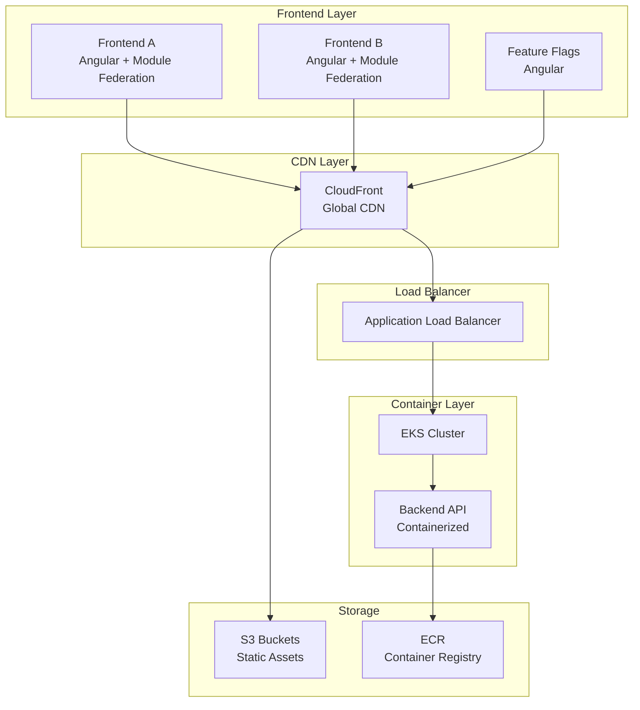

# Arquitectura BillPay

## 🏗️ Arquitectura General

## 🎯 Componentes del Sistema

### Frontend Applications
- **Frontend A**: Aplicación principal de pagos
- **Frontend B**: Panel administrativo
- **Feature Flags**: Gestión de funcionalidades

### Backend Services
- **API Gateway**: Punto de entrada único
- **Payment Service**: Procesamiento de pagos
- **User Service**: Gestión de usuarios
- **Admin Service**: Funciones administrativas

### Infrastructure Services
- **Backstage**: Developer portal
- **Monitoring**: Observabilidad
- **Security**: Autenticación y autorización

## 🔧 Stack Tecnológico

### Frontend
- **Framework**: Angular 17
- **Architecture**: Module Federation
- **Build**: Webpack 5
- **Hosting**: S3 + CloudFront

### Backend
- **Runtime**: Node.js (detectado en análisis)
- **Containerization**: Docker
- **Orchestration**: Kubernetes (EKS)
- **Registry**: Amazon ECR

### Infrastructure
- **IaC**: Terraform
- **CI/CD**: GitHub Actions
- **Monitoring**: CloudWatch
- **Security**: AWS IAM + Secrets Manager

## 📊 Flujo de Datos

1. **Usuario** accede via CloudFront
2. **Frontend** se carga desde S3
3. **API calls** van via ALB a EKS
4. **Backend** procesa en contenedores
5. **Logs** van a CloudWatch
6. **Métricas** se recolectan automáticamente
