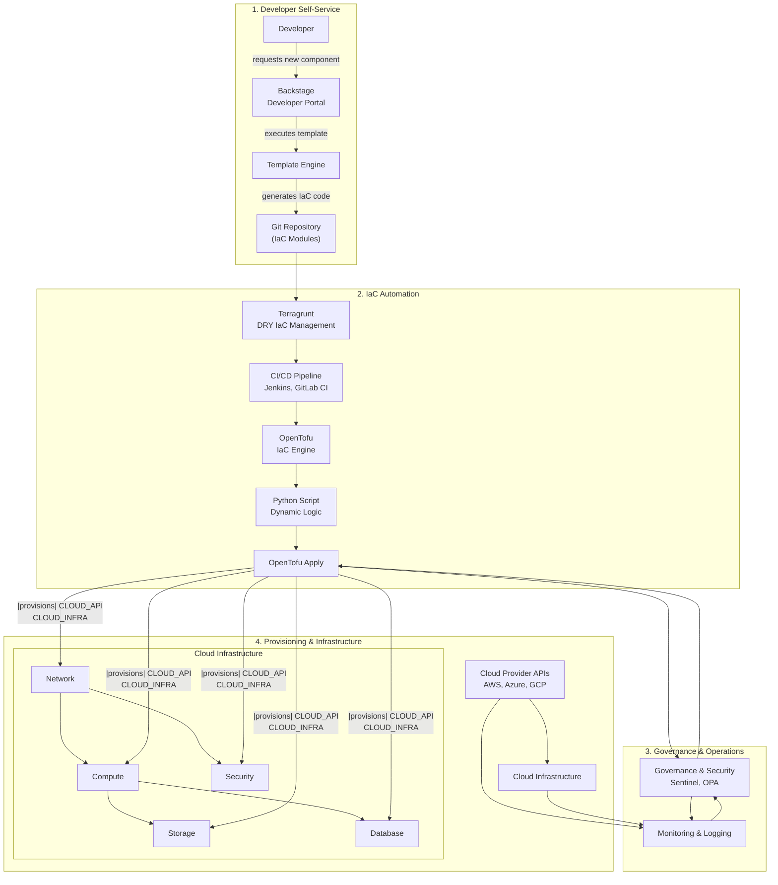
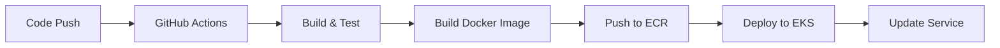

# BillPay - Plataforma de Pagos Microservicios

## 📁 Estructura del Proyecto
```
billpay/
├── poc-billpay-back/              # Backend API (Docker + GitHub Actions)
├── poc-billpay-front-a/           # Frontend Angular (Module Federation)
├── poc-billpay-front-b/           # Frontend Angular (Module Federation)  
├── poc-billpay-front-feature-flags/ # Feature Flags Frontend
├── templates_backstage/           # Backstage Templates
├── ia-ops-iac/                   # Infrastructure as Code (Terraform)
├── mcp-project-analyzer/          # MCP para análisis de proyecto
└── analysis/                     # Resultados de análisis
```

## 🔧 Repositorios

### Repositorios de Aplicación
- **Backend**: `git@github.com:giovanemere/poc-billpay-back.git`
- **Frontend A**: `git@github.com:giovanemere/poc-billpay-front-a.git` (Angular 17 + Module Federation)
- **Frontend B**: `git@github.com:giovanemere/poc-billpay-front-b.git` (Angular 17 + Module Federation)
- **Feature Flags**: `git@github.com:giovanemere/poc-billpay-front-feature-flags.git`

### Repositorios de Templates
- **Backstage Templates**: `git@github.com:giovanemere/templates_backstage.git`

### Repositorio de IaC
- **Infrastructure**: `git@github.com:giovanemere/ia-ops-iac.git`

## 🎯 Stack Tecnológico

### 🔧 Orquestador
- **Backstage** - Plataforma IDP (Internal Developer Platform)
- **GitHub Actions** - CI/CD automatizado
- **GitHub** - Control de versiones y workflows

### 📦 Frontend
- **Angular 17** - Framework principal
- **Module Federation** - Arquitectura de microfrontends
- **TypeScript** - Lenguaje de desarrollo
- **Docker** - Containerización

### 🚀 Backend
- **Docker** - Containerización
- **GitHub Actions** - CI/CD

### ☁️ Infraestructura
- **AWS EKS** - Kubernetes managed
- **Terraform/OpenTofu** - Infrastructure as Code
- **ECR** - Container registry
- **CloudFront + S3** - CDN y hosting estático

## 🏗️ Arquitectura AWS

### Servicios Requeridos

#### Core Infrastructure
- **VPC** - Red aislada (10.0.0.0/16)
- **EKS Cluster** - Orquestación de contenedores
- **ECR Repositories** - Registry de imágenes Docker
- **Application Load Balancer** - Distribución de tráfico
- **NAT Gateway** - Conectividad saliente para subnets privadas

#### Frontend Infrastructure  
- **S3 Buckets** - Hosting de aplicaciones estáticas (3 buckets)
- **CloudFront** - CDN global (3 distribuciones)
- **Route 53** - DNS management (opcional)

#### Security & Monitoring
- **IAM Roles** - Permisos granulares
- **Security Groups** - Firewall de red
- **AWS Secrets Manager** - Gestión de secretos
- **CloudWatch** - Logs y métricas
- **Certificate Manager** - Certificados SSL/TLS

### Costos Estimados (Mensual)
- **EKS Cluster**: ~$73 + $30-100 (nodos)
- **ALB**: ~$20-30
- **NAT Gateway**: ~$45  
- **ECR**: ~$1-5
- **CloudFront**: ~$1-10
- **Route 53**: ~$0.50/zona
- **Total**: ~$170-265/mes

## Pipeline de implementacion


## 🚀 Proceso de Despliegue

### 1. Integración GitHub con Backstage
- Configurar GitHub App para Backstage
- Configurar webhooks y permisos
- Integrar templates con repositorios

### 2. Pipeline de CI/CD


### 3. Compilación y Containerización
- Build de aplicaciones (front/back)
- Generación de imágenes Docker
- Push a Amazon ECR
- Versionado de imágenes

### 4. Infraestructura AWS
- Creación de cluster EKS
- Configuración de networking (VPC, subnets)
- Setup de Load Balancers
- Configuración de IAM roles y policies

### 5. Despliegue de Aplicaciones
- Deploy de microservicios en EKS
- Configuración de ingress controllers
- Setup de monitoring y logging
- Configuración de auto-scaling

### 6. Publicación de Sitios
- Configuración de CloudFront
- Setup de Route 53 para DNS
- Certificados SSL/TLS
- CDN para assets estáticos

## 🔧 Configuración de Entornos

### Desarrollo
- Namespace: `billpay-dev`
- Recursos limitados
- Auto-scaling mínimo

### Staging
- Namespace: `billpay-staging`
- Réplica de producción
- Testing automatizado

### Producción
- Namespace: `billpay-prod`
- Alta disponibilidad
- Monitoring completo
- Backup automatizado

## 📋 Tareas AWS Identificadas

### 1. Preparación de Red
```bash
# VPC y Subnets
aws ec2 create-vpc --cidr-block 10.0.0.0/16
aws ec2 create-subnet --vpc-id <vpc-id> --cidr-block 10.0.1.0/24 --availability-zone us-east-1a
aws ec2 create-subnet --vpc-id <vpc-id> --cidr-block 10.0.2.0/24 --availability-zone us-east-1b
aws ec2 create-internet-gateway
aws ec2 create-nat-gateway
```

### 2. IAM y Seguridad
```bash
# Cluster Service Role
aws iam create-role --role-name EKSClusterRole
aws iam attach-role-policy --role-name EKSClusterRole --policy-arn arn:aws:iam::aws:policy/AmazonEKSClusterPolicy

# Node Group Role
aws iam create-role --role-name EKSNodeRole
aws iam attach-role-policy --role-name EKSNodeRole --policy-arn arn:aws:iam::aws:policy/AmazonEKSWorkerNodePolicy
```

### 3. Container Registry
```bash
# ECR Repositories
aws ecr create-repository --repository-name billpay-backend
aws ecr create-repository --repository-name billpay-frontend-a
aws ecr create-repository --repository-name billpay-frontend-b
aws ecr create-repository --repository-name billpay-feature-flags
```

### 4. EKS Cluster
```bash
# Crear cluster
aws eks create-cluster --name billpay-cluster \
  --version 1.28 \
  --role-arn arn:aws:iam::<account>:role/EKSClusterRole \
  --resources-vpc-config subnetIds=<subnet-ids>,securityGroupIds=<sg-ids>

# Node Groups
aws eks create-nodegroup --cluster-name billpay-cluster \
  --nodegroup-name billpay-nodes \
  --instance-types t3.medium \
  --capacity-type ON_DEMAND
```

### 5. Frontend Infrastructure
```bash
# S3 Buckets
aws s3 mb s3://billpay-frontend-a
aws s3 mb s3://billpay-frontend-b  
aws s3 mb s3://billpay-feature-flags

# CloudFront Distributions
aws cloudfront create-distribution --distribution-config file://frontend-a-config.json
```

## 🛠️ Próximos Pasos

1. **Completar análisis detallado** ✅
2. **Crear MCP de implementación** - En progreso
3. **Configurar Terraform modules**
4. **Implementar CI/CD pipelines**
5. **Desplegar infraestructura AWS**
6. **Configurar Backstage integration**
7. **Deploy de aplicaciones**
8. **Testing y monitoring**
